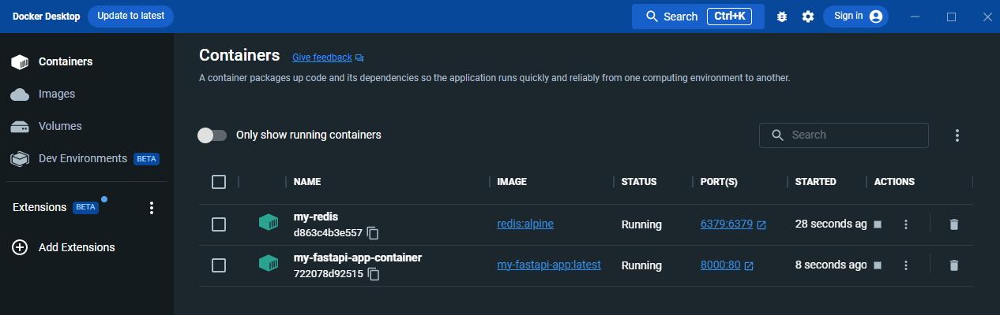

# PT_Demo_Python_FastAPI


## Contents
- [Setup on Windows](#setup-on-windows)
- [FastAPI using Redis in Docker containers0](#fastapi-using-redis-in-docker-containers)
- [Links](#links)

## Setup on Windows

1. Download Python from [the official website](https://www.python.org/downloads/) and install the latest LTS (long term support).

2. Execute the following command to install FastAPI:
```
py -m pip install fastapi
```

3. Execute the following command to install Uvicorn ASGI server for production:
```
py -m pip install "uvicorn[standard]"
```

4. Create a new `main.py` file having the following contents:

```
from typing import Union

from fastapi import FastAPI

app = FastAPI()


@app.get("/")
def read_root():
    return {"Hello": "World"}


@app.get("/items/{item_id}")
def read_item(item_id: int, q: Union[str, None] = None):
    return {"item_id": item_id, "q": q}
```

5. Run the ASGI server from the main.py directory using the following command:

```
py -m uvicorn main:app --reload
```

6. Open the following URLs in the browser:
- http://127.0.0.1:8000/docs => old school Swagger
- http://127.0.0.1:8000/redoc => modern Swagger
- http://127.0.0.1:8000 => {"Hello":"World"}
- http://127.0.0.1:8000/items/6?q=somequery => {"item_id":6,"q":"somequery"}

## FastAPI using Redis in Docker containers

1. Create `main.py` with the following contents:

```
from fastapi import FastAPI, Depends
from redis import Redis, RedisError

app = FastAPI()

def get_redis():
    # Assuming you have a Redis container running on localhost:6379
    # return Redis(host="localhost", port=6379)
    return Redis(host="192.168.1.12", port=6379)
def set_key_value(redis: Redis, key: str, value: str):
    try:
        redis.set(key, value)
        return {"message": f"Key '{key}' set to '{value}'"}
    except RedisError as e:
        return {"error": str(e)}

def get_value_by_key(redis: Redis, key: str):
    try:
        value = redis.get(key)
        if value:
            return {"message": f"Value for key '{key}': {value.decode('utf-8')}"}
        else:
            return {"message": f"Key '{key}' not found"}
    except RedisError as e:
        return {"error": str(e)}

@app.get("/")
def read_root(redis: Redis = Depends(get_redis)):
    return {"message": "Hello, Redis!"}

@app.post("/set/{key}/{value}")
def set_key(redis: Redis = Depends(get_redis), key: str = "", value: str = ""):
    return set_key_value(redis, key, value)

@app.get("/get/{key}")
def get_key(redis: Redis = Depends(get_redis), key: str = ""):
    return get_value_by_key(redis, key)
```

2. Create `Dockerfile` with the following contents:
```
FROM tiangolo/uvicorn-gunicorn-fastapi:python3.8

COPY ./main.py /app/main.py

# Install the required dependencies
RUN pip install redis
```

3. Run the Redis container:
```
docker run -d -p 6379:6379 --name my-redis redis:alpine
```

4. Build the Application image:
```
docker build -t my-fastapi-app .
```

5. Run the Application container:
```
docker run -d -p 8000:80 --name my-fastapi-app-container my-fastapi-app
```



6. Set key-value in Redis using the following `[POST]` endpoint:
```
curl -X POST "http://localhost:8000/set/mykey/myvalue"
```

7. Get the key-value from Redis using the following `[GET]` endpoint:
```
curl "http://localhost:8000/get/mykey"
```

8. Clean up Docker infrastructure:

```
docker stop my-fastapi-app-container
docker rm my-fastapi-app-container
docker stop my-redis
docker rm my-redis
```

## Links
- https://fastapi.tiangolo.com/
- https://stackoverflow.com/questions/39832219/pip-not-working-in-python-installation-in-windows-10
- https://stackoverflow.com/questions/64936440/python-uvicorn-the-term-uvicorn-is-not-recognized-as-the-name-of-a-cmdlet-f
- https://asgi.readthedocs.io/en/latest/